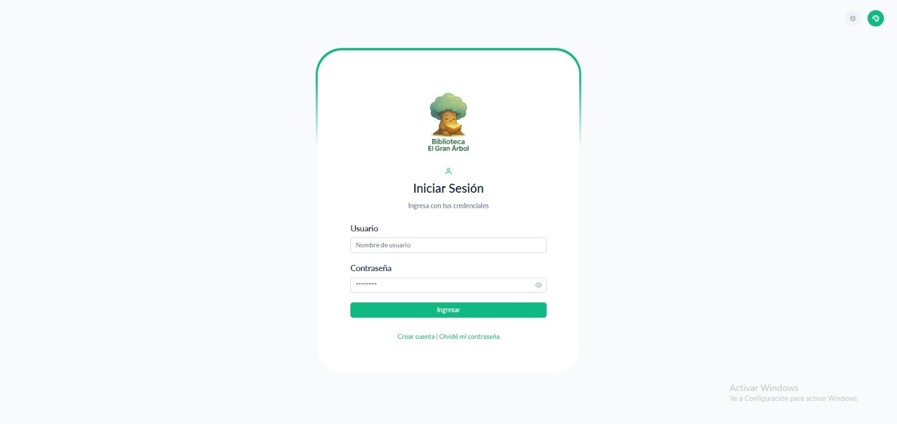
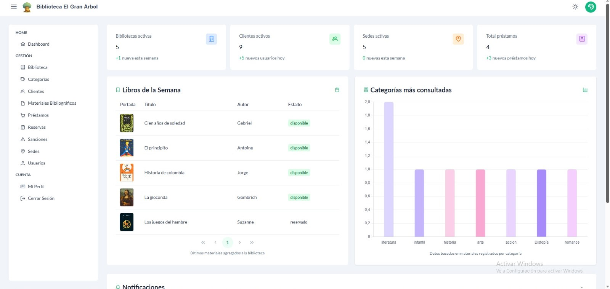

# Sistema de Gestión Bibliotecaria — Frontend

Aplicación web desarrollada con **Angular 20** y **PrimeNG** para la gestión de una red de bibliotecas. Consume la API REST del backend desarrollado en FastAPI.

Incluye autenticación con dos roles: **administrador** y **consumidor**.

## 🌐 Aplicación publicada

> **URL:** [https://gestion-bibliotecaria-frontend.web.app](https://gestion-bibliotecaria-frontend.web.app)





---

## Tecnologías

- **Angular 20**
- **PrimeNG 20** — componentes de UI
- **Tailwind CSS 4** — estilos utilitarios
- **Chart.js** — gráficas en el dashboard
- **RxJS** — manejo de observables
- **TypeScript 5.8**

---

## Requisitos previos

- **Node.js** v18 o superior
- **npm** (incluido con Node.js)
- **Angular CLI** v20

Para verificar versiones:

```bash
node -v
npm -v
ng version
```

---

## Instalación y ejecución

### 1. Clona el repositorio

```bash
git clone <URL-del-repositorio>
cd Gestion-de-Biblioteca-Frontend
```

### 2. Instala las dependencias

```bash
npm install
```

### 3. Configura la URL del backend

En `src/environments/enviroment.ts` ajusta la URL de la API según tu entorno:

```ts
export const environment = {
  production: false,
  apiUrl: 'http://localhost:8000/',  // URL del backend FastAPI
  appName: 'Sistema de Gestión Bibliotecaria',
  version: '1.0.0'
};
```

> El backend debe estar corriendo antes de iniciar el frontend. Consulta el repositorio del backend para las instrucciones de instalación.

### 4. Ejecuta el servidor de desarrollo

```bash
ng serve
```

o

```bash
npm start
```

Luego abre el navegador en:

```
http://localhost:4200
```

---

## Credenciales de acceso por defecto

### Administrador
- **Usuario:** `admin`
- **Contraseña:** `admin123`

Con esta cuenta puedes gestionar todos los módulos del sistema.

### Consumidor (usuario regular)
- **Usuario:** `usuario`
- **Contraseña:** `abc123`

O bien, puedes crear una cuenta nueva desde la pantalla de registro.

> Los usuarios se almacenan en `localStorage` del navegador.

---

## Rutas disponibles

| Ruta | Descripción | Acceso |
|------|-------------|--------|
| `/auth/login` | Inicio de sesión | Público |
| `/auth/register` | Registro de usuario | Público |
| `/dashboard` | Panel principal con estadísticas | Autenticado |
| `/bibliotecas` | Gestión de bibliotecas | Autenticado |
| `/categorias` | Gestión de categorías | Autenticado |
| `/clientes` | Gestión de clientes | Autenticado |
| `/materiales` | Materiales bibliográficos | Autenticado |
| `/prestamos` | Gestión de préstamos | Autenticado |
| `/reservas` | Gestión de reservas | Autenticado |
| `/sanciones` | Gestión de sanciones | Autenticado |
| `/sedes` | Gestión de sedes | Autenticado |
| `/usuarios` | Gestión de usuarios | Autenticado |
| `/perfil` | Perfil del usuario actual | Autenticado |

---

## Estructura del proyecto

```
src/
├── app/
│   ├── core/
│   │   ├── guards/               # AuthGuard, LoginGuard
│   │   ├── models/               # Modelos de respuesta API
│   │   └── services/             # Servicios HTTP por entidad + auth
│   │
│   ├── features/                 # Módulos funcionales
│   │   ├── auth/                 # Login, Register, Access
│   │   ├── biblioteca/
│   │   ├── categoria/
│   │   ├── cliente/
│   │   ├── dashboard/            # Widgets y panel principal
│   │   ├── material-bibliografico/
│   │   ├── perfil/
│   │   ├── prestamo/
│   │   ├── reserva/
│   │   ├── sancion/
│   │   ├── sede/
│   │   └── usuario/
│   │
│   └── shared/
│       ├── components/           # Layout, sidebar, topbar, menú, footer
│       ├── models/               # Interfaces TypeScript por entidad
│       └── service/              # Layout service
│
├── assets/
│   ├── imagenes/                 # Imágenes del sistema
│   ├── layout/                   # Estilos SCSS del layout
│   └── logos/
│
├── environments/
│   ├── enviroment.ts             # Configuración desarrollo
│   └── enviroment.prod.ts        # Configuración producción
│
├── app.component.ts
├── app.config.ts
├── app.routes.ts
├── index.html
└── main.ts
```

---

## Build para producción

```bash
ng build
```

Los archivos compilados se generan en la carpeta `dist/`. El proyecto incluye configuración para despliegue en **Vercel** (`vercel.json`).

---

## Autores

Proyecto académico desarrollado en Angular con PrimeNG por:
- **María Fernanda Palacio**
- **Salomé Gil**

*ITM — 2025*